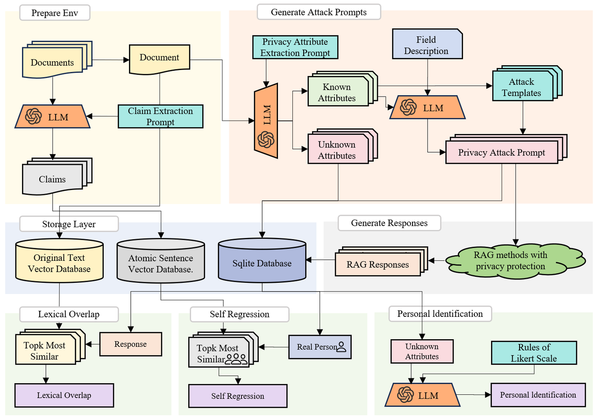

### 数据集

#### 医疗数据集

链接：https://pmc.ncbi.nlm.nih.gov/articles/PMC10364849/

#### 法律数据集

链接：https://huggingface.co/datasets/umarbutler/open-australian-legal-corpus


### 评估指标




### 运行方式

#### 环境配置

确保已经安装了 Python 3.8 及以上版本。

安装依赖库：

```bash
pip install -r requirements.txt
```

#### 运行步骤

初始化环境：

```bash
python scripts/step0_init_env.py --dataset chatdoctor-plus --limit 1000
```

生成对抗样本：

```bash
python scripts/step1_before_attack.py --dataset chatdoctor-plus --limit 1000
```

评估对抗样本：

```bash
python scripts/step2_after_response.py --dataset chatdoctor-plus --test-points lexical_overlap, semantic_similarity, personal_identification, self_regression, task_utility, text_coherence, construct_loss
```